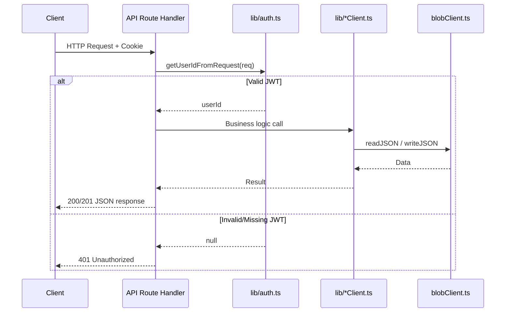
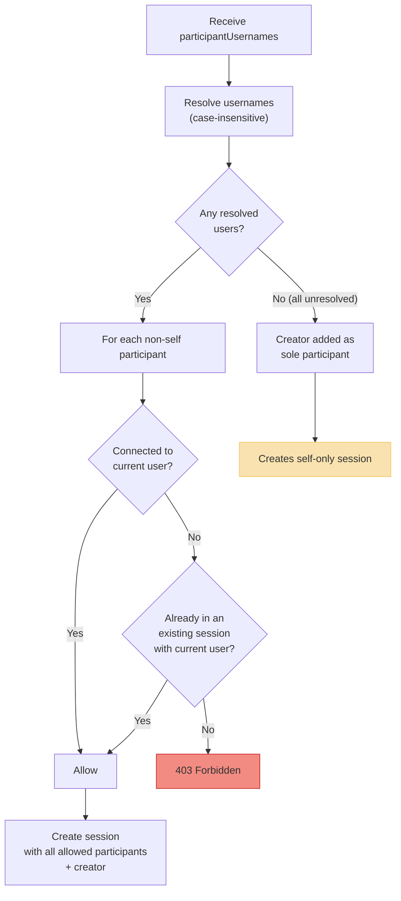

# API Reference

This file documents all server API endpoints implemented under `app/api/`. All endpoints return `application/json` unless noted otherwise.

## Request Lifecycle

Every API request follows this general flow. Auth-protected routes will reject unauthenticated requests before reaching the handler logic.



---

## Auth Endpoints

### `POST /api/auth/signup`

Create a new user account and start a session.

| Property | Detail |
|---|---|
| Auth required | No |
| Rate limit | **5 requests/minute** per client IP |
| Request body | `{ "username": string, "password": string }` |
| Success response | `201` — `{ user: { id, username } }` + `Set-Cookie` header |

**Validation rules:**
- `username` must match `/^[a-zA-Z0-9_.-]{3,32}$/`
- `password` must be non-empty and at most **256 characters**
- Username must not already exist (case-insensitive check)

**Error responses:**
| Status | Condition |
|---|---|
| `400` | Missing or invalid username/password |
| `409` | Username already taken |
| `429` | Rate limit exceeded |

> **Note:** The client-side `AuthForm` enforces stronger password rules (≥8 chars, lowercase, uppercase, number, special character), but the server only checks presence and max length. Direct API callers can create weaker passwords.

---

### `POST /api/auth/login`

Sign in with username and password.

| Property | Detail |
|---|---|
| Auth required | No |
| Rate limit | **10 requests/minute** per client IP |
| Request body | `{ "username": string, "password": string }` |
| Success response | `200` — `{ user: { id, username } }` + `Set-Cookie` header |

**Validation rules:**
- Username and password are length-checked to reject excessively long inputs
- Username lookup is **case-insensitive**
- User must have a `passwordHash` (Google-only users cannot password-login)

**Error responses:**
| Status | Condition |
|---|---|
| `400` | Missing credentials or excessively long input |
| `401` | Invalid username or password |
| `429` | Rate limit exceeded |

---

### `POST /api/auth/logout`

Clear the session cookie.

| Property | Detail |
|---|---|
| Auth required | No |
| Request body | None |
| Success response | `200` — `{ message: "Signed out" }` + `Set-Cookie` (clears cookie) |

---

### `GET /api/auth/me`

Return the currently authenticated user, or `null`.

| Property | Detail |
|---|---|
| Auth required | Yes (returns null/401 if not authenticated) |
| Success response | `200` — `{ user: { id, username } \| null }` |

---

### `GET /api/auth/google`

Initiate Google OAuth flow. Redirects the browser to Google's consent page.

| Property | Detail |
|---|---|
| Auth required | No |
| Requires | `GOOGLE_CLIENT_ID` environment variable |
| Behavior | Generates 32-byte random state, sets `oauth_state` cookie (`HttpOnly`, `SameSite=Lax`), redirects to Google with `openid email profile` scope |

---

### `GET /api/auth/google/callback`

Complete Google OAuth. Exchanges code for profile, creates/links local user, sets session cookie.

| Property | Detail |
|---|---|
| Auth required | No |
| Success behavior | Sets session cookie, redirects to `/chats` |
| Requires | Valid `code`, `state` matching `oauth_state` cookie |
| Profile requirements | `sub`, `email`, and `email_verified` must be present and valid |

**Account linking logic:**
1. Find existing user by `googleId` → use that user
2. Else find user by matching `email` → link Google identity to existing user
3. Else create a new user with a generated username from `given_name`, email local-part, display name, or `google-user`

---

## Chat & Message Endpoints

### `GET /api/chats`

List sessions for the authenticated user.

| Property | Detail |
|---|---|
| Auth required | Yes |
| Success response | `200` — `{ sessions: ChatSession[] }` |

Returns sessions from the user's `user-state` index, sorted by most recent activity.

---

### `POST /api/chats`

Create a new chat session.

| Property | Detail |
|---|---|
| Auth required | Yes |
| Request body | `{ "participantUsernames": string[], "groupName"?: string }` |
| Success response | `201` — `{ session }` |
| Max participants | **20** usernames |

**Authorization flow:**



**Important behavioral notes:**
- Unresolved usernames are **silently ignored** — if all usernames fail to resolve, a self-only session is created
- **Duplicate sessions are allowed** — the route does not deduplicate sessions for the same participant set
- The `isGroup` flag is set based on `participantIds.length > 2`

---

### `GET /api/chats/:sessionId/messages`

Fetch messages for a session.

| Property | Detail |
|---|---|
| Auth required | Yes |
| Authorization | Caller must be a **session participant** |
| Query params | `?limit=50&before=<ISO-timestamp>` |
| Success response | `200` — `{ messages: Message[] }` |

Messages are sorted ascending by timestamp. Returns the last `limit` messages, or the last `limit` before the provided timestamp.

---

### `POST /api/chats/:sessionId/messages`

Post a new message to a session.

| Property | Detail |
|---|---|
| Auth required | Yes |
| Authorization | Caller must be a **session participant** |
| Request body | `{ "content": string }` |
| Success response | `201` — `{ message }` |
| Content limit | **4000 characters** maximum |

**Side effects:**
- Updates session `lastMessagePreview`, `updatedAt`, and `messageCount`
- Updates every participant's `user-state` summary and moves the session to the top

---

### `GET /api/chats/:sessionId/stream`

SSE stream for new messages. Returns `text/event-stream`.

| Property | Detail |
|---|---|
| Auth required | Yes |
| Authorization | Caller must be a **session participant** |
| Response type | `text/event-stream` |
| Events emitted | `event: message` with JSON message data |

**Implementation detail:** This is **polling-based SSE**, not push-based. The server re-reads up to 1000 messages every 1 second and emits any messages newer than the last emitted timestamp. The initial connection sends all recent historical messages before entering the polling loop.

---

## Connection / Social Endpoints

### `GET /api/connections`

Return the authenticated user's social graph.

| Property | Detail |
|---|---|
| Auth required | Yes |
| Success response | `200` — `{ connectedUsers, incomingRequests, outgoingRequests }` |

Request objects are enriched with safe `fromUser`/`toUser` subsets (password hashes and provider IDs are stripped).

---

### `GET /api/connections/search?q=`

Search users by username.

| Property | Detail |
|---|---|
| Auth required | Yes |
| Query params | `?q=<search-term>` (minimum **2 characters**) |
| Success response | `200` — users with connection status per result |

Each result includes a `connectionStatus` field: `connected`, `outgoing`, `incoming`, or `none`.

---

### `POST /api/connections/requests`

Send a connection request.

| Property | Detail |
|---|---|
| Auth required | Yes |
| Request body | `{ "toUserId": string }` |
| Success response | `201` — `{ request }` |

**Behavioral rules:**
- Cannot send a request to yourself
- Duplicate pending/accepted requests for the same pair are **reused**, not duplicated
- A previously declined request can be reactivated into a new pending request

---

### `PATCH /api/connections/requests`

Accept, decline, or cancel a connection request.

| Property | Detail |
|---|---|
| Auth required | Yes |
| Request body | `{ "requestId": string, "action": "accept" \| "decline" \| "cancel" }` |
| Success response | `200` — `{ request }` |

**Authorization:**
- `accept` / `decline` — only the **recipient** (`toUserId`) can perform these actions
- `cancel` — only the **sender** (`fromUserId`) can cancel

**Side effects:**
- Accepting marks **all** pending requests for that user pair as accepted
- Declining/canceling marks **all** pending requests for that pair as declined
- Accepting does **not** automatically create a chat session

---

## User Endpoints

### `GET /api/users`

Return safe user records for users the caller can see.

| Property | Detail |
|---|---|
| Auth required | Yes |
| Success response | `200` — array of `{ id, username }` objects |

Returns connected users and legacy session participants. Password hashes and provider identifiers are stripped.

---

## Examples

Sign up and persist cookies for later requests (curl):

```bash
# Sign up
curl -c cookies.txt -H "Content-Type: application/json" \
  -X POST -d '{"username":"alice","password":"Pass123!"}' \
  http://localhost:3000/api/auth/signup

# List sessions (reuse cookies)
curl -b cookies.txt http://localhost:3000/api/chats

# Send a connection request
curl -b cookies.txt -H "Content-Type: application/json" \
  -X POST -d '{"toUserId":"<user-id>"}' \
  http://localhost:3000/api/connections/requests

# Post a message
curl -b cookies.txt -H "Content-Type: application/json" \
  -X POST -d '{"content":"Hello!"}' \
  http://localhost:3000/api/chats/<sessionId>/messages
```

---

## General Notes

- All auth-protected routes use `getUserIdFromRequest(req)` from `lib/auth.ts` to extract and verify the JWT from the `cookie` header
- Rate limits are **in-memory and per-process** — they reset on server restart and do not coordinate across multiple server instances
- API user responses **strip** `passwordHash`, `googleId`, and other sensitive fields before sending to the client
- Malformed JSON request bodies may produce uncaught route-level errors rather than controlled `400` responses
