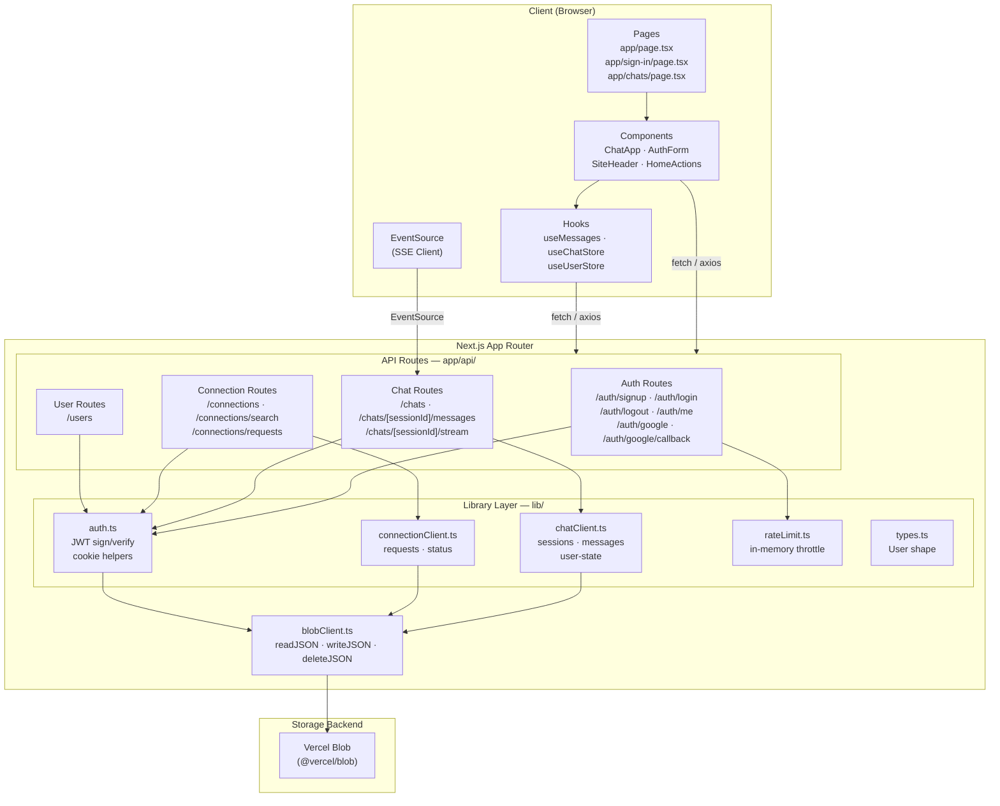
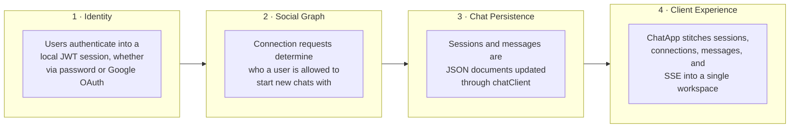
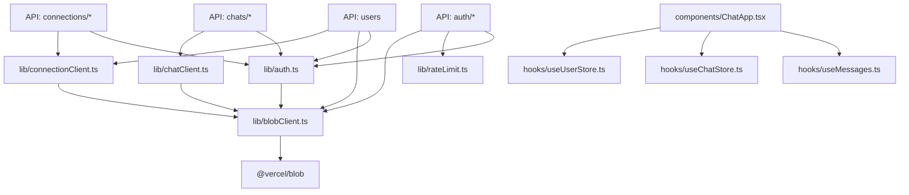
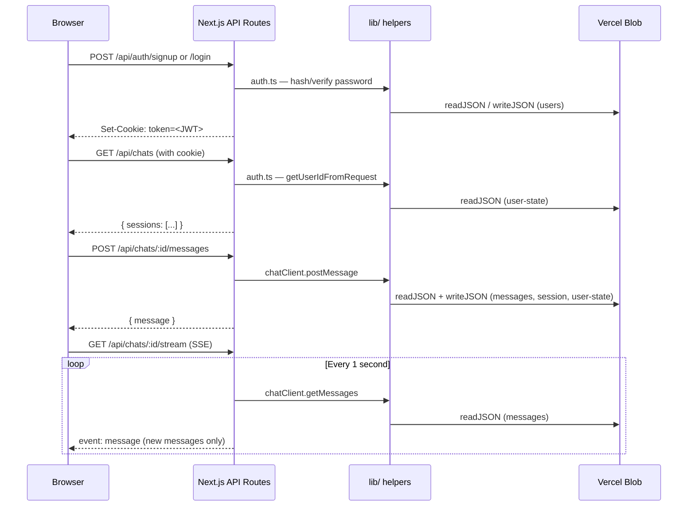

# Architecture Overview

This document gives a high-level view of how the Chat App is organized and where to look when you want to understand or extend its behavior.

## System Architecture

The application follows a layered architecture where the Next.js App Router serves both the UI and the API. All server-side business logic is accessed through API routes, which delegate to library helpers for auth, chat, and connection logic. Data flows through a single storage abstraction (`blobClient`) that currently persists JSON documents to Vercel Blob.

## Four-Layer Mental Model

When reasoning about or changing this app, think of it as four layered systems. Most changes should preserve this layering.

- **Identity**: Google OAuth does not create a parallel session system — it maps Google identity into the existing local user/session model. All auth paths issue the same JWT cookie.
- **Social Graph**: Connection requests are the gatekeeper for new chats. Accepting a connection does *not* automatically create a chat session; the user must explicitly start one.
- **Chat Persistence**: Sessions and messages are separate JSON documents. Each participant also has a `user-state` index for fast session listing.
- **Client Experience**: `ChatApp.tsx` is the main surface and manages auth checks, session lists, connection states, search, and message display using primarily component-local React state.

## Core Ideas

| Concern | Implementation | Key File(s) |
|---|---|---|
| Framework | Next.js 15 App Router + TypeScript (`strict: true`) | `next.config.mjs`, `tsconfig.json` |
| Storage abstraction | `readJSON` / `writeJSON` / `deleteJSON` backed by `@vercel/blob` | `lib/blobClient.ts` |
| Business logic | Chat sessions, messages, and connection requests | `lib/chatClient.ts`, `lib/connectionClient.ts` |
| Auth | JWT signing/verification, cookie helpers, Google OAuth | `lib/auth.ts` |
| Realtime | Server-Sent Events (SSE) — **polling-based** (server re-reads messages every 1 second, not push-based) | `app/api/chats/[sessionId]/stream/route.ts` |
| Client state | Primarily component-local React state in `ChatApp.tsx`. Zustand stores exist in `hooks/` but are currently scaffolding, not the primary state model | `components/ChatApp.tsx`, `hooks/` |
| Rate limiting | In-memory per-process throttling for auth endpoints | `lib/rateLimit.ts` |

## Module Dependency Graph

## Primary Runtime Flow

## Where to Look First

| Area | Path | Description |
|---|---|---|
| Auth endpoints | `app/api/auth/` | Login, signup, logout, me, Google OAuth handlers |
| Chat endpoints | `app/api/chats/` | Session listing, creation, messages, SSE stream |
| Chat logic | `lib/chatClient.ts` | Session & message helpers and type definitions |
| Connection logic | `lib/connectionClient.ts` | Connection request lifecycle and status |
| Storage | `lib/blobClient.ts` | JSON persistence abstraction |
| UI + client logic | `components/` + `hooks/` | React components and client-side hooks |
| Seed data | `data/` | Checked-in JSON reference data |
| Types | `lib/types.ts` | `User` shape; chat/message types in `chatClient.ts` |

## Notes About Extensibility

- **Storage swap**: Replace `lib/blobClient.ts` with a DB-backed implementation (Prisma / Postgres / SQLite) and keep the `lib/*Client` helpers unchanged. The `readJSON`/`writeJSON` interface is the natural seam.
- **Realtime upgrade**: The current SSE implementation polls every second per connected client. Swap for WebSockets, Redis pub/sub, or a hosted realtime service (Pusher, Ably) for lower latency and reduced server load.
- **State management**: The Zustand stores (`useChatStore`, `useUserStore`) are ready scaffolding if you want to centralize client state away from `ChatApp.tsx` component-local state.
