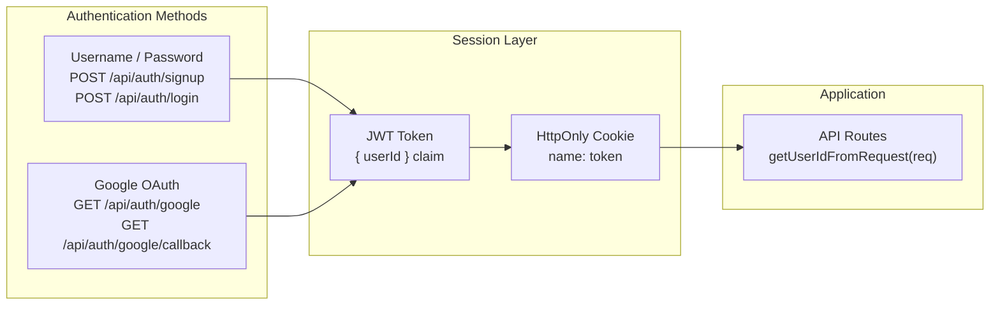
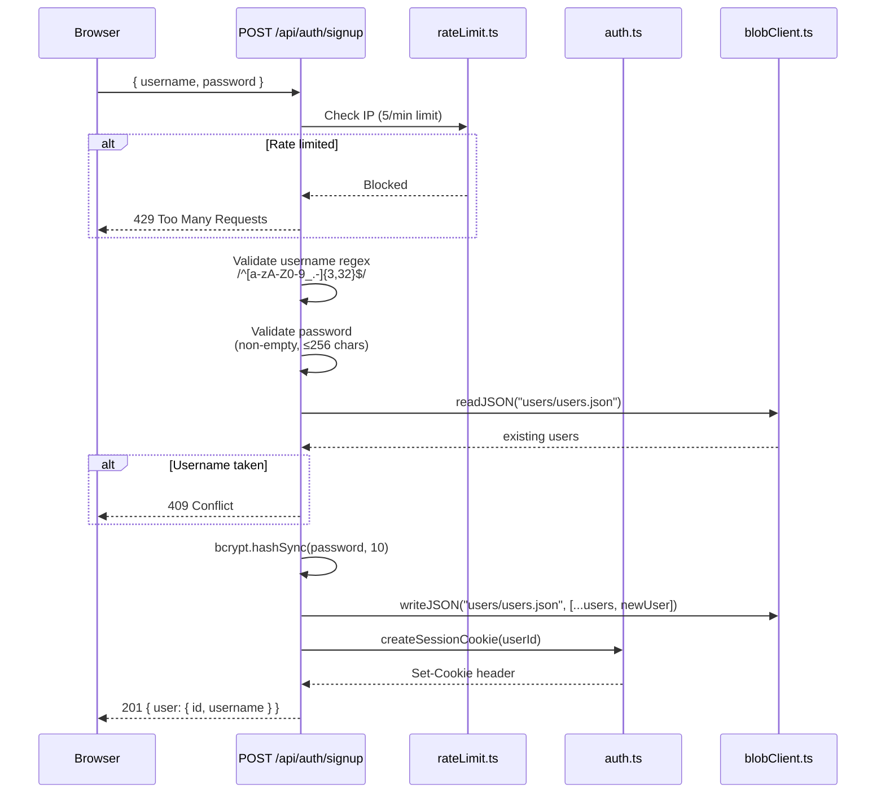
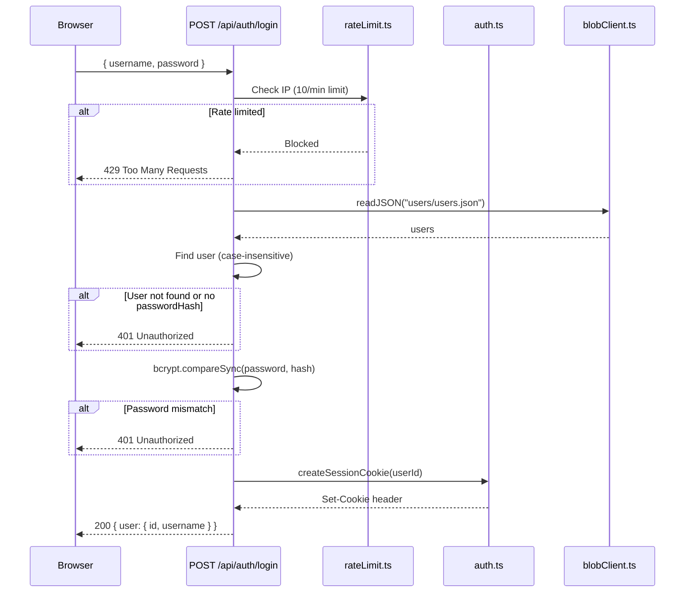
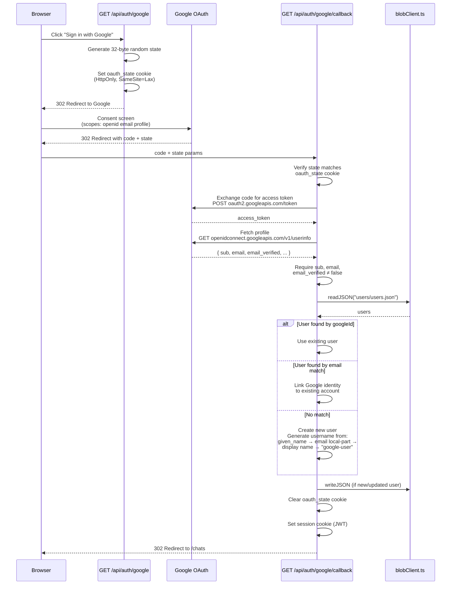

# Authentication

Authentication in this project is intentionally small and self-contained to make local development and interviews straightforward. All auth paths — username/password and Google OAuth — produce the same JWT session cookie, so the rest of the application never needs to know *how* a user authenticated.

## Authentication Overview



## How It Works

1. The server issues JSON Web Tokens (JWTs) containing a `userId` claim. Tokens are signed with `process.env.JWT_SECRET`.
2. A signed token is set into an HttpOnly cookie named `token` using `createSessionCookie(...)` from `lib/auth.ts`.
3. Incoming API requests call `getUserIdFromRequest(req)` to extract the token from the `cookie` header and validate it with `verifyToken(...)`.
4. If validation fails, the route returns `401 Unauthorized`.

## Cookie Properties

| Property | Value | Purpose |
|---|---|---|
| `HttpOnly` | `true` | Not accessible from JavaScript — prevents XSS token theft |
| `SameSite` | `Strict` | Prevents cross-site request leaks (CSRF protection) |
| `Path` | `/` | Cookie sent on all requests to the app |
| `Max-Age` | `604800` (7 days) | Session duration |
| `Secure` | Only when `NODE_ENV === 'production'` | Requires HTTPS in production |

## JWT Payload

```json
{
  "userId": "<uuid>",
  "iat": 1234567890,
  "exp": 1235172690
}
```

## Dev vs. Production

| Concern | Development | Production |
|---|---|---|
| `JWT_SECRET` | Falls back to `dev-secret` | **Required** — app throws if not set |
| `Secure` cookie flag | Not set (allows HTTP) | Set (requires HTTPS) |
| Google OAuth | Optional — use username/password instead | Requires `GOOGLE_CLIENT_ID` and `GOOGLE_CLIENT_SECRET` |

> **Warning:** The `dev-secret` fallback is convenient for local work but must **never** be used in production. Set a strong, unique `JWT_SECRET` in your production environment.

## Username / Password Auth

### Signup Flow



**Validation rules:**
- Username: `/^[a-zA-Z0-9_.-]{3,32}$/`
- Password: non-empty, at most 256 characters
- Username uniqueness: case-insensitive check

### Login Flow



**Important:** Google-only users (those created via OAuth without setting a password) do not have a `passwordHash` and cannot sign in with username/password.

### Password Validation: Client vs. Server

| Rule | Client (`AuthForm`) | Server (`POST /api/auth/signup`) |
|---|---|---|
| Minimum length | 8 characters | 1 character (non-empty) |
| Maximum length | — | 256 characters |
| Lowercase letter | Required | Not checked |
| Uppercase letter | Required | Not checked |
| Number | Required | Not checked |
| Special character | Required | Not checked |

> **Note:** The client enforces strong password rules before submitting, but direct API callers (curl, scripts) can create weaker passwords because the server only checks presence and max length.

## Google OAuth Flow

Google OAuth is implemented without an external OAuth library. It maps Google identity into the existing local user and session model — no parallel session system is created.



### Account Linking Logic

When a user completes Google OAuth, the callback determines their local identity using this priority:

1. **Match by `googleId`** — If a user already has this Google sub ID, use that account
2. **Match by `email`** — If a user exists with the same email, link the Google identity to that account
3. **No match** — Create a new user with a generated username

**Username generation** tries these sources in order:
- `given_name` from the Google profile
- Local part of the email address (before `@`)
- Full `name` / display name
- Fallback: `google-user`

Each candidate is sanitized and made unique if needed.

### OAuth Cookie Properties

| Cookie | Properties | Purpose |
|---|---|---|
| `oauth_state` | `HttpOnly`, `SameSite=Lax`, `Path=/` | CSRF protection for the OAuth redirect. `SameSite=Lax` is required because the callback is a cross-site redirect from Google. Cleared after use. |

## Rate Limiting

| Endpoint | Limit | Window |
|---|---|---|
| `POST /api/auth/signup` | 5 requests | Per minute, per client IP |
| `POST /api/auth/login` | 10 requests | Per minute, per client IP |

Rate limiting is **in-memory and per-process**:
- Resets when the server restarts or redeploys
- Does not coordinate across multiple server instances
- Returns `429 Too Many Requests` when exceeded

## Security Considerations

**Strengths:**
- JWT cookie is `HttpOnly` — not accessible from client-side JavaScript
- `SameSite=Strict` provides strong CSRF protection for the session cookie
- Production requires `JWT_SECRET` and `Secure` cookies
- API responses strip `passwordHash`, `googleId`, and other sensitive fields
- OAuth uses a random state token stored in a separate cookie

**Limitations:**
- No explicit CSRF tokens for non-OAuth state-changing routes (mitigated by `SameSite=Strict`)
- Server-side password validation is weaker than client-side enforcement
- Rate limiting is per-process only and resets on redeploy

## Testing Locally

- For local testing without OAuth, use `POST /api/auth/signup` and `POST /api/auth/login` to create and sign in users
- To use Google OAuth locally:
  1. Create a Google OAuth client in the [Google Cloud Console](https://console.cloud.google.com/apis/credentials)
  2. Add `http://localhost:3000/api/auth/google/callback` as an authorized redirect URI
  3. Set `GOOGLE_CLIENT_ID` and `GOOGLE_CLIENT_SECRET` in `.env.local`
