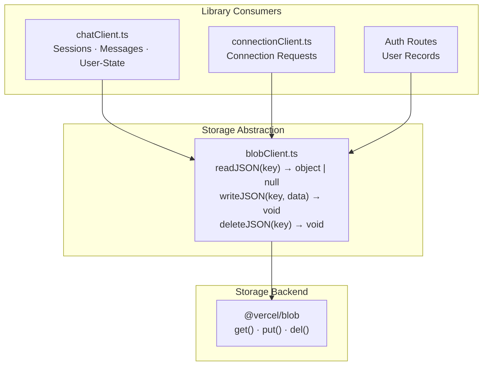
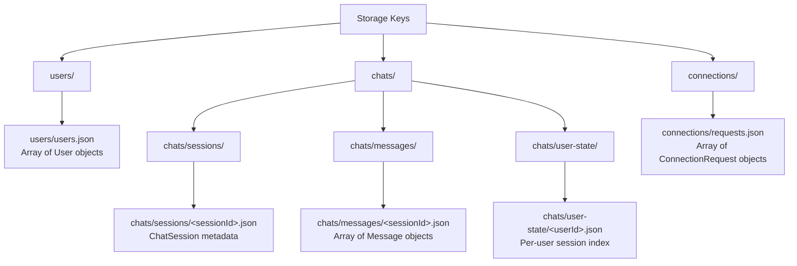
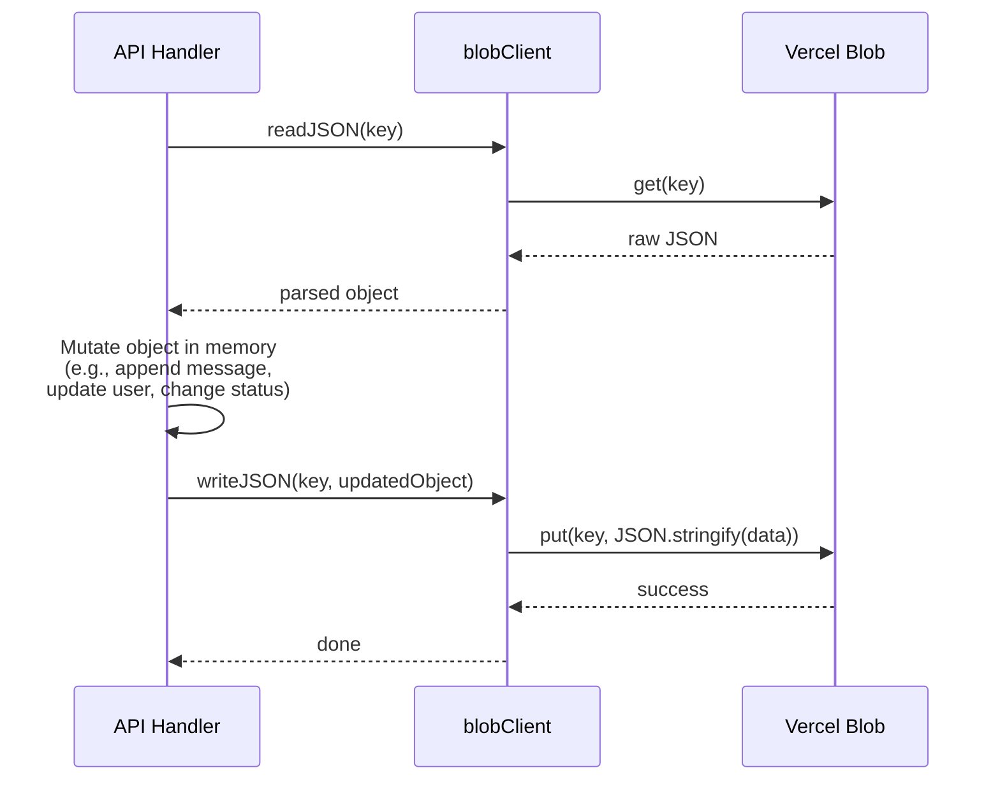

# Blob / Storage

Storage in this project is accessed through the `lib/blobClient.ts` abstraction, which exposes three functions: `readJSON`, `writeJSON`, and `deleteJSON`. All server-side data persistence flows through this single module.

## Storage Architecture



## Current Implementation

> **Important:** The current `lib/blobClient.ts` implementation **always uses `@vercel/blob`**. There is no filesystem fallback when `BLOB_READ_WRITE_TOKEN` is absent. The `data/` directory contains checked-in seed/reference data, but it is not read by `blobClient.ts` in the current code.

| Function | Behavior |
|---|---|
| `readJSON(key)` | Calls `get(key)` from `@vercel/blob`. Returns parsed JSON or `null` if not found. |
| `writeJSON(key, data)` | Calls `put(key, JSON.stringify(data))` from `@vercel/blob`. Overwrites existing data. |
| `deleteJSON(key)` | Calls `del(key)` from `@vercel/blob`. |

## Configuration

| Variable | Required | Purpose |
|---|---|---|
| `BLOB_READ_WRITE_TOKEN` | **Yes** (for current implementation) | Authentication token for `@vercel/blob` API calls |

## Storage Keys Reference

All data is stored as JSON documents addressed by path-style keys:



| Key Pattern | Data | Written By |
|---|---|---|
| `users/users.json` | Array of all user records | Auth signup, Google OAuth callback |
| `chats/sessions/<sessionId>.json` | Single `ChatSession` metadata object | `chatClient.createSession`, `chatClient.postMessage` |
| `chats/messages/<sessionId>.json` | Array of `Message` objects for one session | `chatClient.postMessage` |
| `chats/user-state/<userId>.json` | Per-user session summary index | `chatClient.createSession`, `chatClient.postMessage` |
| `connections/requests.json` | Array of all `ConnectionRequest` objects | `connectionClient` create/update |

## Read-Modify-Write Pattern

All data mutations follow a read-modify-write pattern. This is simple but has concurrency implications:



### Concurrency Warning

> **Warning:** There is no locking or optimistic concurrency control. If two requests read the same key simultaneously, mutate independently, and write back, **the second write silently overwrites the first**. This can cause data loss in these scenarios:
>
> - Two users sign up at the exact same time (both read `users/users.json`, each appends their user, second write drops the first user)
> - Two users post messages to the same session simultaneously
> - Concurrent connection request updates
>
> This is acceptable for a prototype/demo but would need a database with proper transactions for production use.

## Local Development

The repository contains a `data/` directory with seed JSON files for reference and quick local demos. Since the current `blobClient.ts` does not read from the filesystem, you have two options for local development:

### Option 1: Use Vercel Blob locally (current behavior)

Set `BLOB_READ_WRITE_TOKEN` in `.env.local` to point at a Vercel Blob store. This is the only way the current code can read and write data.

### Option 2: Add a filesystem fallback (not yet implemented)

You can modify `lib/blobClient.ts` to fall back to the local `data/` directory when `BLOB_READ_WRITE_TOKEN` is not set:

```ts
// in lib/blobClient.ts (development helper)
import fs from 'fs/promises'
import path from 'path'

const dataDir = path.join(process.cwd(), 'data')

export async function readJSON(key: string) {
  if (!process.env.BLOB_READ_WRITE_TOKEN) {
    try {
      const text = await fs.readFile(path.join(dataDir, key), 'utf8')
      return JSON.parse(text)
    } catch (err: any) {
      if (err.code === 'ENOENT') return null
      throw err
    }
  }
  // otherwise use @vercel/blob (existing logic)
}
```

This fallback is **suggested but not implemented** in the current codebase.

## Important Notes

- **Local vs. Remote**: Running locally and running in production operate on different storage backends. Changes made locally to `data/` will not propagate to a remote blob store, and vice versa.
- **Storage swap**: To replace the entire storage backend (e.g., with PostgreSQL or SQLite), implement a new `lib/blobClient.ts` that matches the `readJSON`/`writeJSON`/`deleteJSON` interface. No other code needs to change.
- **JSON size**: All documents are small JSON arrays that are read and rewritten wholesale. For production scale, consider a database with indexed queries and transactional writes.
