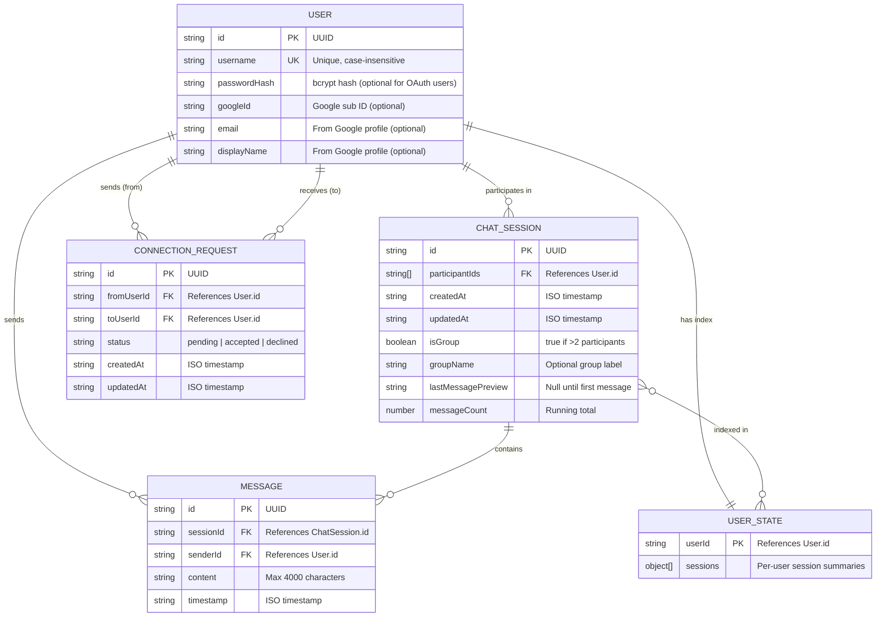
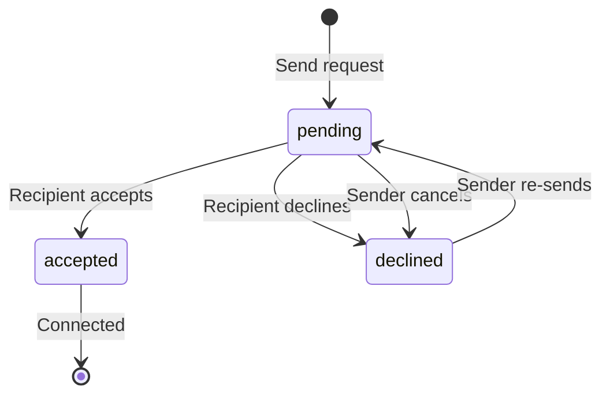

# Data Layout

This document describes the data model, type definitions, storage key structure, and relationships between entities in the Chat App.

## Entity Relationship Diagram



## Type Definitions

These types are defined in the source code and are the authoritative shapes for all data.

### User (`lib/types.ts`)

```ts
type User = {
  id: string            // UUID
  username: string      // Unique, matches /^[a-zA-Z0-9_.-]{3,32}$/
  passwordHash?: string // bcrypt hash — absent for Google-only users
  googleId?: string     // Google OAuth sub ID
  email?: string        // From Google profile
  displayName?: string  // From Google profile
}
```

### ChatSession (`lib/chatClient.ts`)

```ts
type ChatSession = {
  id: string                      // UUID
  participantIds: string[]        // Array of User.id values
  createdAt: string               // ISO timestamp
  updatedAt: string               // ISO timestamp
  isGroup: boolean                // true when participantIds.length > 2
  groupName?: string              // Optional label for group chats
  lastMessagePreview?: string | null  // Preview of most recent message
  messageCount: number            // Running count of messages
}
```

### Message (`lib/chatClient.ts`)

```ts
type Message = {
  id: string        // UUID
  sessionId: string // References ChatSession.id
  senderId: string  // References User.id
  content: string   // Message text (max 4000 characters)
  timestamp: string // ISO timestamp
}
```

### ConnectionRequest (`lib/connectionClient.ts`)

```ts
type ConnectionRequest = {
  id: string        // UUID
  fromUserId: string // References User.id (sender)
  toUserId: string   // References User.id (recipient)
  status: 'pending' | 'accepted' | 'declined'
  createdAt: string  // ISO timestamp
  updatedAt: string  // ISO timestamp
}
```

## Storage Key Structure

Data is stored as JSON documents addressed by path-style keys. The `data/` folder mirrors this structure with seed files.

```mermaid
graph TD
    subgraph StorageKeys["Storage Key Layout"]
        direction TB
        users["users/users.json<br/>📄 Array of User"]
        sessions["chats/sessions/&lt;sessionId&gt;.json<br/>📄 ChatSession"]
        messages["chats/messages/&lt;sessionId&gt;.json<br/>📄 Array of Message"]
        userstate["chats/user-state/&lt;userId&gt;.json<br/>📄 Per-user session index"]
        requests["connections/requests.json<br/>📄 Array of ConnectionRequest"]
    end

    subgraph SeedFiles["Checked-In data/ Files"]
        direction TB
        seed_users["data/users/users.json ✅<br/>2 seed users (test, test2)"]
        seed_sessions["data/chats/sessions/*.json ✅<br/>5 session files"]
        seed_messages["data/chats/messages/*.json ✅<br/>2 message files"]
        seed_userstate["data/chats/user-state/*.json ✅<br/>2 user-state files"]
        seed_requests["data/connections/requests.json ❌<br/>Not checked in"]
        seed_legacy["data/users.json ⚠️<br/>Legacy — empty array, unused"]
    end
```



## Checked-In Seed Data

| Path | Status | Notes |
|---|---|---|
| `data/users/users.json` | ✅ Present | Contains 2 password-backed seed users: `test` and `test2` |
| `data/users.json` | ⚠️ Legacy | Top-level file with an empty array — **not used by any code**. The active path is `data/users/users.json`. |
| `data/chats/sessions/*.json` | ✅ Present | 5 session files, including some self-only sessions (single participant) |
| `data/chats/messages/*.json` | ✅ Present | 2 message files |
| `data/chats/user-state/*.json` | ✅ Present | 2 user-state index files |
| `data/connections/requests.json` | ❌ Missing | No seed file — the code treats a missing file as an empty request list |

> **Note:** `data/users.json` and `data/users/users.json` are separate files. The code uses `users/users.json` as the storage key. The top-level `data/users.json` appears to be legacy and is not referenced.

## Data Behaviors

### User State Index

Each user has a `user-state` file that contains a summary of their sessions for fast listing. When a session is created or a message is posted:

1. The session summary is added/updated in each participant's user-state
2. The active session is moved to the **top** of the list (most recent first)
3. `lastMessagePreview` and `messageCount` are synced from the session

### Duplicate Sessions

The system **allows duplicate sessions** for the same participant set. The UI compensates by grouping active chats by display name and showing only the newest session when multiple sessions map to the same name.

### Self-Only Sessions

If all participant usernames in a `POST /api/chats` request fail to resolve, the creator is added as the sole participant, creating a self-only session. The seed data contains examples of this.

### Connection Request Lifecycle



- Duplicate pending/accepted requests between the same user pair are **reused** rather than duplicated
- Accepting marks **all** pending requests for that pair as accepted
- Declining/canceling marks **all** pending requests for that pair as declined

## Working With Data Files

- For quick experiments, edit the JSON files directly. After editing, the app will pick up changes when requests call the storage helpers.
- To create users via the API, call `POST /api/auth/signup`.
- To restore committed seed state:

```bash
# Reset all committed files under data/
git checkout -- data/
```

> **Important:** If you run the app with a remote blob store (`BLOB_READ_WRITE_TOKEN`), changes to the local `data/` directory are **not** synchronized to the remote store. See [blob-storage.md](blob-storage.md) for details on the current storage implementation.
