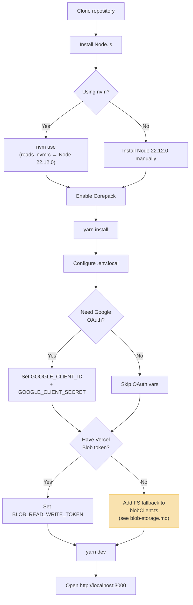

# Local Development

Guide to get the project running locally, with complete environment setup, dependency details, and common workflow recipes.

## Setup Flowchart



## Prerequisites

| Requirement | Version | Notes |
|---|---|---|
| Node.js | `22.12.0` (pinned in `.nvmrc`) | Use `nvm use` to load the correct version |
| Corepack | Bundled with Node | Must be enabled for Yarn 4 |
| Yarn | `4.14.1` (pinned in `package.json`) | Managed by Corepack |

```bash
# Load correct Node version
nvm use

# Enable Corepack (required once)
corepack enable

# If Yarn isn't set up yet
yarn set version berry
```

## Install and Run

```bash
cd chat-app
yarn install
yarn dev
```

The app listens on `http://localhost:3000` by default.

## Build / Type-Check

```bash
yarn build
```

## Project Dependencies

| Package | Purpose |
|---|---|
| `next` (v15) | App Router framework — server and client |
| `react` / `react-dom` (v18) | UI rendering |
| `@vercel/blob` | JSON document persistence (Vercel Blob storage) |
| `bcryptjs` | Password hashing for signup/login |
| `jsonwebtoken` | JWT creation and verification |
| `uuid` | Unique ID generation for users, sessions, messages, requests |
| `zustand` | State management (scaffolding — currently lightly used) |
| `axios` | HTTP client for client-side API calls |
| `@tailwindcss/postcss` | Tailwind CSS integration |

## Environment Variables

Create a `.env.local` file in the project root:

```env
# Required — used to sign JWT session tokens
JWT_SECRET=your_long_random_secret

# Optional — Google OAuth (only if testing OAuth flows)
GOOGLE_CLIENT_ID=...
GOOGLE_CLIENT_SECRET=...

# Required — Vercel Blob storage token
# The current blobClient.ts always uses @vercel/blob.
# Without this token, readJSON/writeJSON calls will fail.
# To use local data/ files instead, add a FS fallback (see docs/blob-storage.md).
BLOB_READ_WRITE_TOKEN=...
```

### Variable Reference

| Variable | Required | Default | Purpose |
|---|---|---|---|
| `JWT_SECRET` | Yes (production) | `dev-secret` in non-production | Signs JWT session tokens. Use a strong, unique value in production. |
| `GOOGLE_CLIENT_ID` | Only for OAuth | — | Google OAuth application client ID |
| `GOOGLE_CLIENT_SECRET` | Only for OAuth | — | Google OAuth application secret |
| `BLOB_READ_WRITE_TOKEN` | Yes (current impl.) | — | Auth token for `@vercel/blob`. Without this and without a filesystem fallback, storage operations will fail. |

> **Important:** The current `lib/blobClient.ts` always calls `@vercel/blob`. The `data/` directory contains seed/reference data but is **not automatically used** as a fallback when `BLOB_READ_WRITE_TOKEN` is absent. See [blob-storage.md](blob-storage.md) for details and a suggested filesystem fallback.

## Seed Data and Accounts

A small set of seed files exists under `data/`:

| Path | Contents |
|---|---|
| `data/users/users.json` | 2 seed users: `test`, `test2` |
| `data/chats/sessions/*.json` | 5 example sessions |
| `data/chats/messages/*.json` | 2 message arrays |
| `data/chats/user-state/*.json` | 2 user-state index files |

> **Note:** `data/users.json` (top-level) is a legacy empty array and is **not used** by the application. The active user data path is `data/users/users.json`.

### Creating Accounts

Use `POST /api/auth/signup` to create local accounts:

```bash
curl -c cookies.txt -H "Content-Type: application/json" \
  -X POST -d '{"username":"alice","password":"Pass123!"}' \
  http://localhost:3000/api/auth/signup
```

### Resetting Sample Data

If you modify files under `data/` and want to restore the original committed state:

```bash
git checkout -- data/
```

## Common Workflows

### Create a user and start a chat

```bash
# 1. Sign up user A
curl -c alice.txt -H "Content-Type: application/json" \
  -X POST -d '{"username":"alice","password":"Pass123!"}' \
  http://localhost:3000/api/auth/signup

# 2. Sign up user B
curl -c bob.txt -H "Content-Type: application/json" \
  -X POST -d '{"username":"bob","password":"Pass456!"}' \
  http://localhost:3000/api/auth/signup

# 3. Alice sends connection request to Bob (need Bob's user ID from signup response)
curl -b alice.txt -H "Content-Type: application/json" \
  -X POST -d '{"toUserId":"<bob-user-id>"}' \
  http://localhost:3000/api/connections/requests

# 4. Bob accepts the request (need request ID from previous response)
curl -b bob.txt -H "Content-Type: application/json" \
  -X PATCH -d '{"requestId":"<request-id>","action":"accept"}' \
  http://localhost:3000/api/connections/requests

# 5. Alice starts a chat with Bob
curl -b alice.txt -H "Content-Type: application/json" \
  -X POST -d '{"participantUsernames":["bob"]}' \
  http://localhost:3000/api/chats

# 6. Alice sends a message (need session ID from previous response)
curl -b alice.txt -H "Content-Type: application/json" \
  -X POST -d '{"content":"Hello Bob!"}' \
  http://localhost:3000/api/chats/<session-id>/messages
```

### Check connection status

```bash
# List connected users and pending requests
curl -b alice.txt http://localhost:3000/api/connections

# Search for a user
curl -b alice.txt "http://localhost:3000/api/connections/search?q=bob"
```

## Debugging Tips

- **Authentication failures**: Make sure your browser accepts cookies and `JWT_SECRET` is set in `.env.local`.
- **Blob client errors**: If you see errors from `readJSON`/`writeJSON`, either set `BLOB_READ_WRITE_TOKEN` or add the filesystem fallback described in [blob-storage.md](blob-storage.md).
- **Rate limit blocks**: The app applies in-memory rate limiting (5/min signup, 10/min login). If you hit `429`, wait a minute or restart the dev server.
- **Node version issues**: Use `nvm use` to ensure you're running Node 22.12.0. Older versions may cause compatibility issues with Yarn 4 or Next.js 15 features.

## Next Steps for a Dev Machine

- Add a small seed/reset script to automate account creation via `curl` for demos and interviews
- Consider implementing the filesystem fallback in `blobClient.ts` for offline local development
- Set up Google OAuth credentials if you need to test the full auth flow
