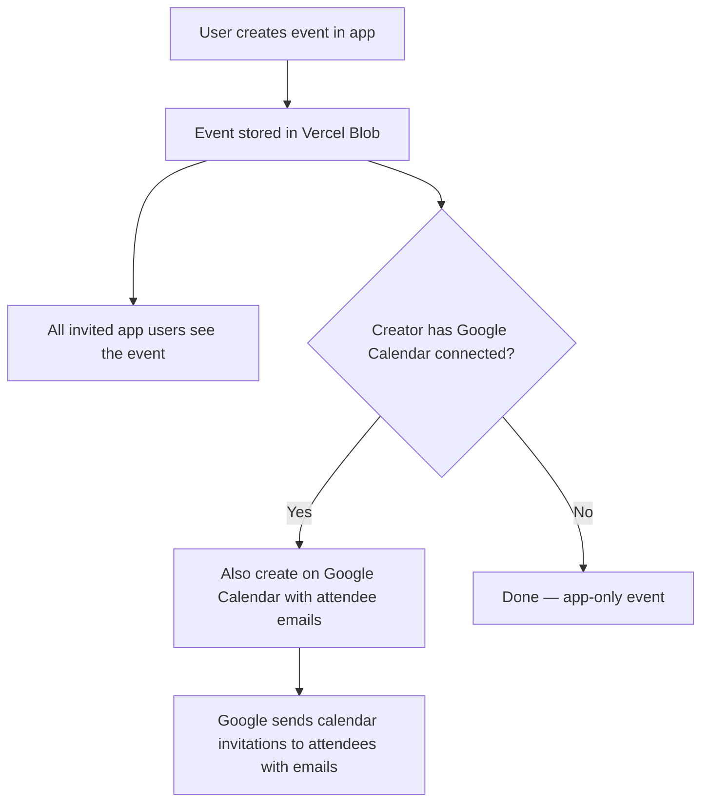

# App-Native Calendar with Optional Google Calendar Sync

Add an in-app event scheduling system where any authenticated user can create events and invite connected app users. Optionally, Google-authenticated users can connect their Google Calendar to sync events there and send Google Calendar invitations.

## User Review Required

> [!IMPORTANT]
> **Google Cloud Console configuration required** (for the Google Calendar sync feature only). You'll need to enable the **Google Calendar API** in your Google Cloud project and add `https://www.googleapis.com/auth/calendar.events` to the OAuth consent screen's scopes.

> [!WARNING]
> **Two-layer design.** The app calendar works independently of Google. Google Calendar is a pure add-on — events exist in-app regardless of whether anyone has connected Google Calendar. This means:
> - Password-only users can create events and invite people.
> - Google users who haven't connected their calendar can also create and receive events.
> - Only users who explicitly "Connect Google Calendar" get sync + email invitations via Google.

## Proposed Changes

### Architecture Overview



---

### Data Model

#### [NEW] [lib/calendarClient.ts](file:///Users/dryga/dev/chat-app/lib/calendarClient.ts)

New data types and CRUD functions for app-native events:

```typescript
type CalendarEvent = {
  id: string
  creatorId: string
  title: string
  description?: string
  startDateTime: string      // ISO 8601
  endDateTime: string        // ISO 8601
  attendeeUserIds: string[]  // app user IDs (includes creator)
  googleEventId?: string     // set if synced to Google Calendar
  googleEventLink?: string   // set if synced to Google Calendar
  createdAt: string
  updatedAt: string
}
```

Storage: `calendar/events.json` — a single JSON array (consistent with `connections/requests.json` pattern).

Functions:
- `createEvent(creatorId, details)` → creates and stores the event, returns it
- `listEventsForUser(userId)` → returns events where `attendeeUserIds` includes the user, sorted by `startDateTime`
- `getEvent(eventId)` → fetch a single event
- `updateEventGoogleSync(eventId, googleEventId, googleEventLink)` → update after Google sync

#### [NEW] [lib/googleCalendarClient.ts](file:///Users/dryga/dev/chat-app/lib/googleCalendarClient.ts)

Google Calendar API integration:
- `createGoogleCalendarEvent(user, eventDetails, attendeeEmails)` → POST to Google Calendar API
- `refreshGoogleAccessToken(refreshToken)` → refresh expired tokens
- Handles 401 → refresh → retry flow transparently

#### [MODIFY] [lib/types.ts](file:///Users/dryga/dev/chat-app/lib/types.ts)

Add to `User` interface:
- `googleAccessToken?: string`
- `googleRefreshToken?: string`
- `googleCalendarConnected?: boolean`

---

### OAuth — Connect Google Calendar

#### [NEW] [app/api/auth/google/calendar/route.ts](file:///Users/dryga/dev/chat-app/app/api/auth/google/calendar/route.ts)

- Requires existing authentication (JWT cookie check).
- Redirects to Google OAuth with scopes: `openid email profile https://www.googleapis.com/auth/calendar.events`.
- Uses `access_type=offline` and `prompt=consent` to get a refresh token.
- Sets `oauth_calendar_state` cookie.

#### [NEW] [app/api/auth/google/calendar/callback/route.ts](file:///Users/dryga/dev/chat-app/app/api/auth/google/calendar/callback/route.ts)

- Validates state cookie.
- Exchanges code for `access_token` + `refresh_token`.
- Stores both tokens on the user record in `users/users.json`.
- Sets `googleCalendarConnected: true`.
- Clears state cookie, redirects to `/chats`.

---

### API Routes — Events

#### [NEW] [app/api/calendar/events/route.ts](file:///Users/dryga/dev/chat-app/app/api/calendar/events/route.ts)

**`GET`** — List events for the authenticated user.
- Returns events sorted by start time (upcoming first).
- Enriches each event with attendee usernames.

**`POST`** — Create a new event.
- Requires auth.
- Body: `{ title, description?, startDateTime, endDateTime, attendeeUserIds }`.
- Validates:
  - Title is required, max 200 chars.
  - Start/end are valid ISO datetimes, end > start.
  - All `attendeeUserIds` must be real app users and connected to the creator.
  - Max 50 attendees.
- Creator is always added to attendees.
- Stores the event via `calendarClient.createEvent()`.
- If the creator has `googleCalendarConnected`:
  - Resolves attendee emails from user records.
  - Calls `googleCalendarClient.createGoogleCalendarEvent()`.
  - Updates the event with `googleEventId` and `googleEventLink`.
- Returns the created event.

---

### UI Components

#### [NEW] [components/CalendarEventModal.tsx](file:///Users/dryga/dev/chat-app/components/CalendarEventModal.tsx)

A modal for creating a calendar event, triggered from the chat header:

- **Title** input (required)
- **Description** textarea (optional)
- **Start date/time** — `datetime-local` input
- **End date/time** — `datetime-local` input, defaults to 1 hour after start
- **Attendees** — Checkboxes listing connected app users (by username). Chat participants are pre-checked.
- **Google Calendar badge** — If the creator has Google Calendar connected, shows a small indicator: "📅 Will also create on Google Calendar". If not connected, shows a subtle "Connect Google Calendar" link.
- **Create Event** button → POST to `/api/calendar/events`
- **Success state** → shows confirmation with optional Google Calendar link
- **Error state** → inline error message
- Styled to match the app (white card, rounded, Tailwind blue accents, shadow).

#### [MODIFY] [components/ChatApp.tsx](file:///Users/dryga/dev/chat-app/components/ChatApp.tsx)

Changes:
1. **User state** — After `/api/auth/me`, store `googleCalendarConnected` and `authProvider` on the user object.
2. **Chat header** — Add a calendar icon button (📅) next to the participant name / "Private chat" label:
   - Opens `CalendarEventModal` with current chat participants pre-selected.
3. **Event list in sidebar** — Add a new card below "Active chats" showing upcoming events for the user:
   - Fetches from `GET /api/calendar/events` on mount.
   - Shows event title, date/time, and attendee count.
   - Clicking an event could expand details inline.
4. **Modal state** — `calendarModalOpen`, `calendarEvents`, and related loading state.

#### [MODIFY] [app/api/auth/me/route.ts](file:///Users/dryga/dev/chat-app/app/api/auth/me/route.ts)

- Add to `safeUser` response:
  - `googleCalendarConnected: !!user.googleCalendarConnected`
  - `authProvider: user.authProvider || 'password'`

#### [MODIFY] [app/api/users/route.ts](file:///Users/dryga/dev/chat-app/app/api/users/route.ts)

- Include `email` in the safe user projection for connected users (needed by the calendar API to send Google invites, but only exposed server-side — the attendee picker uses usernames).

---

### File Summary

| File | Action | Purpose |
|------|--------|---------|
| [types.ts](file:///Users/dryga/dev/chat-app/lib/types.ts) | MODIFY | Add Google token fields to User |
| [calendarClient.ts](file:///Users/dryga/dev/chat-app/lib/calendarClient.ts) | NEW | App-native event CRUD (Vercel Blob storage) |
| [googleCalendarClient.ts](file:///Users/dryga/dev/chat-app/lib/googleCalendarClient.ts) | NEW | Google Calendar API calls + token refresh |
| [app/api/auth/google/calendar/route.ts](file:///Users/dryga/dev/chat-app/app/api/auth/google/calendar/route.ts) | NEW | Incremental OAuth for calendar scope |
| [app/api/auth/google/calendar/callback/route.ts](file:///Users/dryga/dev/chat-app/app/api/auth/google/calendar/callback/route.ts) | NEW | OAuth callback, store tokens |
| [app/api/calendar/events/route.ts](file:///Users/dryga/dev/chat-app/app/api/calendar/events/route.ts) | NEW | GET/POST events API |
| [components/CalendarEventModal.tsx](file:///Users/dryga/dev/chat-app/components/CalendarEventModal.tsx) | NEW | Event creation modal UI |
| [components/ChatApp.tsx](file:///Users/dryga/dev/chat-app/components/ChatApp.tsx) | MODIFY | Calendar button in header + events sidebar |
| [app/api/auth/me/route.ts](file:///Users/dryga/dev/chat-app/app/api/auth/me/route.ts) | MODIFY | Expose calendarConnected + authProvider |
| [app/api/users/route.ts](file:///Users/dryga/dev/chat-app/app/api/users/route.ts) | MODIFY | Include email for connected users |

## Verification Plan

### Manual Verification
1. **Password-only user** → can create an in-app event, invite connected users, sees it in sidebar. No Google Calendar button.
2. **Google user (no calendar connected)** → can create in-app events. Sees "Connect Google Calendar" link in the modal.
3. **Google user (calendar connected)** → creates event → appears both in-app and on their Google Calendar. Attendees with emails get Google Calendar invites.
4. **Attendee view** → invited users see the event in their sidebar events list.
5. **Validation** → empty title rejected, end before start rejected, non-connected user IDs rejected.
6. **Token refresh** → simulate expired access token, verify auto-refresh works.

### Build Verification
- `yarn build` completes without TypeScript errors.
